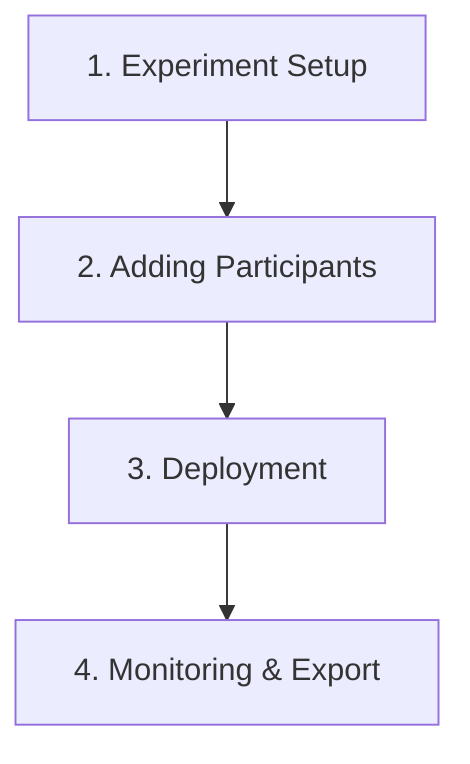

This guide assumes you are a researcher conducting experiments, or a participant in a study using PRISM. It is expected that an instance of PRISM is running, as described in the [Setup Guide](developer.qmd), and you have access to it.

The **PRISM Research Portal** serves as the control center for designing experiments, managing study cohorts, and reviewing participant data.

PRISM helps researchers collect real-world data through a smartphone application aimed to gently catch particiopants in a moment of hearing difficulty. PRISM can capture a snapshot of your real-world environment in that moment. This includes:

- **Audio**: A short 30-second clip of the sound around you.
- **Context**: Your rating of how hard it was to hear speech.

This data helps build the PRISM machine learning framework to automatically recognise difficult listening situations and adjust hearing aids in real-time.

The **PRISM web frontend** serves as the interface for data collection and study management for **Researchers** conducting "experiments" within the **PRISM** ecosystem. Researchers use this application to design experiments, manage study cohorts, and deploy tasks to **Participants**. It is the control center for your data collection needs.

### Study Workflow Overview

Running a PRISM study follows four major phases:

1. **Experiment Setup**: Configure basic information, sensor parameters, rule-based triggers, and feedback buttons in the Research Portal.
2. **Adding Participants**: Upload a participant roster via CSV and send automated email invitations.
3. **Deployment**: Participants receive invitation emails, install the Android app, and click the link to sync their device config automatically.
4. **Monitoring & Export**: Review participant compliance, view real-time wearable graphs, and download raw data or audio recordings.

---

## 1. Experiment Setup

### Step 1: Sign up

Click "Sign up with Email". 

Then you should receive a verification email:

Note: If you try to click "Sign up" again, it will show you "An account with this email already exists." You won't be able to sign in unless you click the link to verify it. Once you have verified your email by clicking the link, you can see the following prompt:

### Step 2: Notification

Click "Set up", it will guide you to the first page.

### Step 3: Setup the first experiment

Click "Create experiment".

### Step 4: Fill up the basic information

### Step 5: Configure Sensor Details
Enable or disable independent tracking for **Smartphone** and **Smartwatch** hardware layers. You can specify a custom sampling frequency (Hz) for physiological sensors and explicitly opt-in to **Upload Raw Audio** (privacy warning: sends un-processed audio streams directly to cloud storage).

### Step 6: Select ML Models
Select and configure on-device analytical models for the experiment:
- **YAMNet+ Environment Analysis**: Classifies real-time acoustic environments (e.g., open space, food court) using normalized `float32` input buffers.
- **Words of Not Understanding (WONU)**: Detects spoken linguistic cues (e.g., *"pardon?"*, *"sorry, what?"*) signaling a communication breakdown.

### Step 7: Define Automation Triggers
Build rule-based triggers automating model inference and user prompt generation using the visual builder:

#### Sensor Lists

| Sensor Source (Input) | Allowed Metrics (Units) | Allowed Operators | Compatible Target Models / Actions | Threshold Guidance |
|---|---|---|---|---|
| **Phone Microphone** | Decibel (dB) | `>`, `<`, `=` | Wake YAMNet+ / WONU, or Launch Form | e.g., `0 - 120 dB` |
| **Watch Microphone** | Decibel (dB) | `>`, `<`, `=` | Wake YAMNet+ / WONU, or Launch Form | e.g., `0 - 120 dB` |
| **Heart Rate** | BPM | `>`, `<`, `=` | Wake YAMNet+ / WONU, or Launch Form | e.g., `30 - 220 BPM` |
| **Temperature** | Celsius (°C) | `>`, `<`, `=` | Wake YAMNet+ / WONU, or Launch Form | e.g., `-10 - 50 °C` |

### Step 8: Customise Feedback Buttons
Configure simple categorical labels for ecological momentary self-reports presented to users during an assessment moment (default labels: *Good*, *Okay*, *Poor*).

Confirm your feedback buttons.

### Step 9: (Optional) Add Google Form Survey Link
Prompt users to complete an external web survey (e.g., Google Forms) for deeper subjective commentary following their recording session.

### Step 10: Review and Confirm Details
Confirm the summary configuration draft before publishing.

---

## 2. Adding Participants

### Step 11: View all experiments

### Step 12: Add and Manage Participants

Click "My First Experiment".

Confirm it by clicking "Save and add participants".

Example CSV file formatting (expected columns: `email`, `name`):

Drag your csv file then you should be able to see participants. Once loaded, researchers can trigger batch email invitations to all assigned members.

You can edit participants by clicking on it and you should be able to see "Email", "View data", "Remove". Note: Here the "View data" is disabled, that’s because there’s no response for that participant yet. Removing a participant permanently deletes all associated response records and audio storage payloads.

Click save, it will show "Saving…". Afterward it will guide you back to the experiment list.

---

## 3. Deployment

Once you have added participants to the Research Portal and clicked **Invite**, the PRISM system manages deployment to devices automatically:

1. **Invitation Email**: The backend sends an automated invitation email to each participant.
2. **Download App**: The email instructs the participant to download the PRISM Android/Watch app.
3. **Activation Link**: When the participant clicks the unique invite link on their phone, it registers their participant ID and downloads the experiment's specific configuration rules (sampling rates, triggers, models) from Firestore to their device. No manual device side setup is required by the researcher.

---

## 4. During & Post-Experiment

### Step 13: Check Session Recordings
Once participants have used the app and data collection has begun you can click "View data" for a particular participant.

### Step 14: View the Recordings
Review detailed time-series graphs and metadata attributes.

### Step 15: Download Datasets
Download signed raw sensor archives and audio files directly via temporary short-lived pre-signed secure URLs.

Log back in to modify experiments and view the data at any time.

---

## 5. Participant User Guide

Download the PRISM App to your device. Then follow the instructions to participate in a research experiment.

> [!TIP]
> Most researchers will print out or share a customised version of this section as a one-page guide for their study cohort.

### Step 1: Join the experiment

Once the participant clicks the invite link from their email, they will be able to see this interface. Click "Open".

{height=400px}

### Step 2: Starting the experiment

{height=400px}

- **The Recording Period**: This is the block of time (Like a 4 hour window)
- **The Recording Session**: Those are the individual "sessions" (short recordings) that happen inside it.

### Step 3: Sending a recording

{height=400px}

### Step 4: Finish the session

{height=400px}
